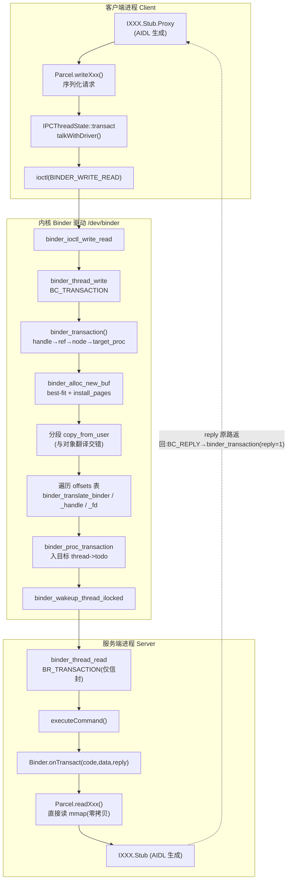
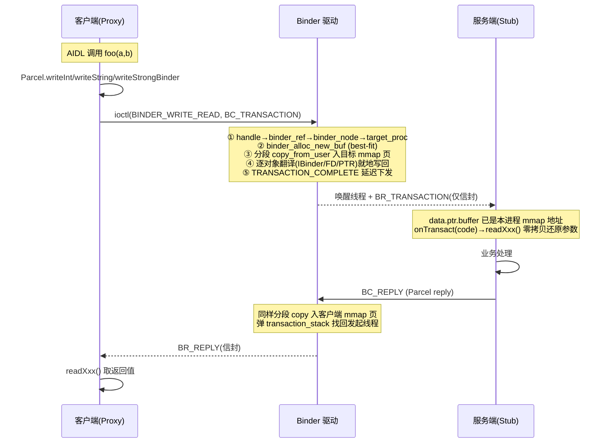
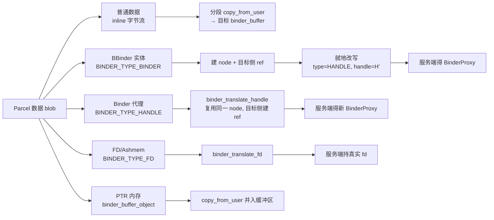

# Binder 数据传输示例流程分析（android14-6.1）

> 基于当前工作区 `kernel_common/kernels/drivers/android/`（Android 通用内核 android14-6.1）全链路整理
> 整理日期：2026-08-31
> 姊妹篇：`Binder数据结构传输示意流程分析.md`（基于 cells-android10，**行号与实现已不同，勿混用**）
> 配套结构汇总：`binder_all_structs.h`（本目录，参考用，勿参与构建）

本文用一个**固定的具体示例**，把一次 Binder 调用中"数据如何从客户端 Parcel 到达服务端 Parcel"的每一个内核函数调用、每一个真实参数都列出来。为便于与 android10 版对照，示例场景保持一致：

客户端 `Client`（pid=A，`binder_proc *A`）调用服务端 `Server`（pid=B，`binder_proc *B`）的方法，`code=7`，`Parcel` 数据区内联了 `int` + `String` + 一个 `IBinder` 回调，回调对象位于数据区偏移 `P` 处（占 24 字节，即 `sizeof(flat_binder_object)`）；`data_size=N`，`offsets_size=8`（64 位下一个偏移 8 字节）。下文所有参数值都基于这个例子。

> **注意**：与 android10 相比，本版本的数据拷贝**不再是"一次整块拷贝 + 原地改写"**，而是**分段拷贝、逐对象交错进行**。这是本版最重要的行为变化，详见阶段 2f 与第四节。

---

## 阶段 0：用户态填信封（驱动外，作为入口约定）

`IPCThreadState::writeTransactionData` 把参数填进 `binder_transaction_data tr`（64 字节），随后 `ioctl(binder_fd, BINDER_WRITE_READ, &bwr)`。进入内核后 `binder_ioctl_write_read` 解析 `binder_write_read`，调用
`binder_thread_write(proc=A, thread=client_thread, bwr.write_buffer, bwr.write_size, &bwr.write_consumed)`。

---

## 阶段 1：写路径 —— 进入 BC_TRANSACTION

入口函数签名（`binder.c:4237`）：

```4450:4460:kernel_common/kernels/drivers/android/binder.c
		case BC_TRANSACTION:
		case BC_REPLY: {
			struct binder_transaction_data tr;

			if (copy_from_user(&tr, ptr, sizeof(tr)))
				return -EFAULT;
			ptr += sizeof(tr);
			binder_transaction(proc, thread, &tr,
					   cmd == BC_REPLY, 0);
			break;
		}
```

具体参数：

```
copy_from_user(&tr, ptr, sizeof(struct binder_transaction_data)=64)
  → tr 的内容（本例）：
      tr.target.handle      = H        (Server 的 handle；SM 为 0)
      tr.code               = 7
      tr.flags              = 0        (同步；oneway 时为 TF_ONE_WAY)
      tr.data_size          = N
      tr.offsets_size       = 8
      tr.data.ptr.buffer    = <Client 用户态 Parcel 数据区指针>
      tr.data.ptr.offsets   = <Client 用户态偏移表指针>

binder_transaction(
      proc                = A,                    /* 调用方进程 */
      thread              = client_thread,        /* 发起线程 */
      tr                  = &tr,                  /* 上面这份信封（栈上） */
      reply               = cmd==BC_REPLY (本例 0),
      extra_buffers_size  = 0)                    /* 非 SG 版本固定为 0 */
```

若走 `BC_TRANSACTION_SG`（`binder.c:4439`），则多一个 `tr.buffers_size` 参数传给 `extra_buffers_size`，用于 scatter-gather 大块数据。

---

## 阶段 2：`binder_transaction` 内核核心（签名在 `binder.c:3168`）

```3168:3172:kernel_common/kernels/drivers/android/binder.c
static void binder_transaction(struct binder_proc *proc,
			       struct binder_thread *thread,
			       struct binder_transaction_data *tr, int reply,
			       binder_size_t extra_buffers_size)
{
```

### 步骤 2a — 解析目标（handle → ref → node → target_proc）

按 `tr->target.handle` 在 `proc->refs_by_desc` 红黑树里找到 `binder_ref`，再拿 `ref->node`，最后取 `target_proc = node->proc`：

```3286:3298:kernel_common/kernels/drivers/android/binder.c
			binder_proc_lock(proc);
			ref = binder_get_ref_olocked(proc, tr->target.handle,
						     true);
			if (ref) {
				target_node = binder_get_node_refs_for_txn(
						ref->node, &target_proc,
						&return_error);
			} else {
				binder_user_error("%d:%d got transaction to invalid handle, %u\n",
						  proc->pid, thread->pid, tr->target.handle);
				return_error = BR_FAILED_REPLY;
			}
			binder_proc_unlock(proc);
```

具体参数：

```
binder_get_ref_olocked(proc=A, desc=H, need_strong_ref=true)
  → 命中 A->refs_by_desc 中的 binder_ref
  → ref->node 即 Server 的 binder_node

binder_get_node_refs_for_txn(
      node  = ref->node,
      procp = &target_proc,        /* 输出：本例 = B */
      error = &return_error)
  → 同时按强/弱引用把 node 钉住（binder_inc_node_nilocked），
    防止发送方在事务完成前死亡导致 node 被过早释放
```

**handle==0 的特例**：目标解析走 context manager 分支（`binder.c:3300`），直接取 `context->binder_context_mgr_node`，并额外校验"不能向自己拥有的 context manager 发事务"。

`binder_get_node_refs_for_txn` 若发现 `node->proc == NULL`（目标进程已死），设 `*error = BR_DEAD_REPLY`。

### 步骤 2b — 在**目标进程**分配缓冲区

```3507:3509:kernel_common/kernels/drivers/android/binder.c
	t->buffer = binder_alloc_new_buf(&target_proc->alloc, tr->data_size,
		tr->offsets_size, extra_buffers_size,
		!reply && (t->flags & TF_ONE_WAY));
```

具体参数：

```
binder_alloc_new_buf(
      alloc               = &B->alloc,        /* 注意：目标进程 B 的分配器 */
      data_size           = N,
      offsets_size        = 8,
      extra_buffers_size  = 0,
      is_async            = !0 && (0 & TF_ONE_WAY) = false)   /* 同步事务 */
→ 返回 struct binder_buffer *，或 ERR_PTR(-ESRCH / -EINVAL / -ENOSPC / -ENOMEM)
```

错误处理（`binder.c:3510-3526`）把 errno 翻译成驱动返回码：`-ESRCH → BR_DEAD_REPLY`（"vma cleared, target dead or dying"），`-ENOSPC`` → BR_FAILED_REPLY`，这正是用户态 `TransactionTooLargeException` / `DeadObjectException` 的来源。

内部实现要点：
- `binder_alloc_new_buf`（`binder_alloc.c:649`）先做参数合规检查（`sanitized_size`），再调用 `binder_alloc_new_buf_locked`（`binder_alloc.c:517`）在 `free_buffers` 红黑树上做 **best-fit** 查找并按需切分；
- 异步事务有独立额度：`if (is_async && alloc->free_async_space < size)` 直接 `-ENOSPC`（`binder_alloc.c:530`）；
- 本版把**页安装**拆成了独立步骤 `binder_install_buffer_pages`（`binder_alloc.c:694`），与缓冲块分配解耦。

### 步骤 2c — 拷贝（可选）安全上下文

若启用了 `FLAT_BINDER_FLAG_TXN_SECURITY_CTX`，驱动把发送方 security context 拷进缓冲区尾部：

```3535:3537:kernel_common/kernels/drivers/android/binder.c
		err = binder_alloc_copy_to_buffer(&target_proc->alloc,
						  t->buffer, buf_offset,
						  lsmctx.context, lsmctx.len);
```

`buf_offset` 按 `ALIGN(data_size) + ALIGN(offsets_size) + ALIGN(extra_buffers_size) - ALIGN(len, 8)` 计算，即从缓冲区末尾倒排。

### 步骤 2d — 拷贝偏移表（紧跟在数据区之后）

```3551:3557:kernel_common/kernels/drivers/android/binder.c
	if (binder_alloc_copy_user_to_buffer(
				&target_proc->alloc,
				t->buffer,
				ALIGN(tr->data_size, sizeof(void *)),
				(const void __user *)
					(uintptr_t)tr->data.ptr.offsets,
				tr->offsets_size)) {
```

具体参数：

```
binder_alloc_copy_user_to_buffer(
      alloc          = &B->alloc,
      buffer         = t->buffer,
      buffer_offset  = ALIGN(N, 8),                       /* 数据区末尾对齐处 */
      from           = (void __user*)tr->data.ptr.offsets,/* Client 用户态偏移表 */
      bytes          = 8)
```

随后校验 `offsets_size` 必须是 `sizeof(binder_size_t)` 的整数倍（`binder.c:3565`），否则 `BR_FAILED_REPLY` / `-EINVAL`。

### 步骤 2e — 真正的跨进程拷贝（分段进行，★ 关键变化）

本版**不再**先整块 `copy_from_user` 全部 `N` 字节，而是在遍历每个对象时，"把从上一个位置到当前对象之间的普通数据"拷进来：

```3610:3621:kernel_common/kernels/drivers/android/binder.c
		/*
		 * Copy the source user buffer up to the next object
		 * that will be processed.
		 */
		copy_size = object_offset - user_offset;
		if (copy_size && (user_offset > object_offset ||
				object_offset > tr->data_size ||
				binder_alloc_copy_user_to_buffer(
					&target_proc->alloc,
					t->buffer, user_offset,
					user_buffer + user_offset,
					copy_size))) {
```

第一轮（本例只有一个对象，位于偏移 `P`）的具体参数：

```
binder_alloc_copy_user_to_buffer(
      alloc          = &B->alloc,
      buffer         = t->buffer,
      buffer_offset  = user_offset = 0,
      from           = user_buffer + 0,   /* Client 用户态 Parcel 数据区基址 */
      bytes          = copy_size = P - 0 = P)   /* 只拷对象之前的普通数据 */
```

函数内部逐页完成真正的跨进程拷贝（`binder_alloc.c:1321`）：

```1330:1348:kernel_common/kernels/drivers/android/binder_alloc.c
	while (bytes) {
		unsigned long size;
		unsigned long ret;
		struct page *page;
		pgoff_t pgoff;
		void *kptr;

		page = binder_alloc_get_page(alloc, buffer,
					     buffer_offset, &pgoff);
		size = min_t(size_t, bytes, PAGE_SIZE - pgoff);
		kptr = kmap_local_page(page) + pgoff;
		ret = copy_from_user(kptr, from, size);   /* ★ 跨进程拷贝发生在这里 */
		kunmap_local(kptr);
		if (ret)
			return bytes - size + ret;
		bytes -= size;
		from += size;
		buffer_offset += size;
	}
```

> 对比 android10：旧版用 `kmap()/kunmap()`，本版已改为 `kmap_local_page()/kunmap_local()`（更快、不全局 TLB 失效）；内核内部拷贝 `binder_alloc_do_buffer_copy`（`binder_alloc.c:1352`）也改用 `memcpy_to_page()/memcpy_from_page()` 取代旧的 `memcpy`。

### 步骤 2f — 解析并翻译对象，就地写回

取对象（注意本版**直接读发送方用户缓冲区**，而非先拷进内核再读）：

```3629:3641:kernel_common/kernels/drivers/android/binder.c
		object_size = binder_get_object(target_proc, user_buffer,
				t->buffer, object_offset, &object);
		if (object_size == 0 || object_offset < off_min) {
			binder_user_error("%d:%d got transaction with invalid offset (%lld, min %lld max %lld) or object.\n",
					  proc->pid, thread->pid,
					  (u64)object_offset,
					  (u64)off_min,
					  (u64)t->buffer->data_size);
```

具体参数：

```
binder_get_object(
      proc   = B,
      u      = user_buffer,        /* 发送方用户态 Parcel 基址（本版新增） */
      buffer = t->buffer,
      offset = P,                  /* 数据区中该对象的偏移 */
      object = &object)            /* 输出 */
→ 返回 object_size = sizeof(struct flat_binder_object) = 24
```

`binder_get_object`（`binder.c:1958`）按 `hdr->type` 判定对象大小（`binder.c:1985`）：

| 类型 | 尺寸 |
|---|---|
| `BINDER_TYPE_BINDER` / `WEAK_BINDER` | `sizeof(flat_binder_object)` = 24 |
| `BINDER_TYPE_HANDLE` / `WEAK_HANDLE` | `sizeof(flat_binder_object)` = 24 |
| `BINDER_TYPE_FD` | `sizeof(binder_fd_object)` |
| `BINDER_TYPE_PTR` | `sizeof(binder_buffer_object)` |
| `BINDER_TYPE_FDA` | `sizeof(binder_fd_array_object)` |

本例 `hdr->type = BINDER_TYPE_BINDER`，走实体→句柄的翻译：

```3651:3670:kernel_common/kernels/drivers/android/binder.c
		case BINDER_TYPE_BINDER:
		case BINDER_TYPE_WEAK_BINDER: {
			struct flat_binder_object *fp;

			fp = to_flat_binder_object(hdr);
			ret = binder_translate_binder(fp, t, thread);

			if (ret < 0 ||
			    binder_alloc_copy_to_buffer(&target_proc->alloc,
							t->buffer,
							object_offset,
							fp, sizeof(*fp))) {
```

具体参数：

```
binder_translate_binder(fp, t, thread)          /* binder.c:2398 */
  fp     = 指向刚解析出的 flat_binder_object（源值：type=BINDER, binder=<A 的 BBinder*>, cookie）
  t      = 当前事务
  thread = client_thread
  → 在 A 侧为实体建/找 binder_node，在 B 侧建 binder_ref 拿到 rdata.desc = H'
  → 就地改写 fp：type = BINDER_TYPE_HANDLE, binder = 0, handle = H', cookie = 0

binder_alloc_copy_to_buffer(
      alloc          = &B->alloc,
      buffer         = t->buffer,
      buffer_offset  = P,          /* 同一个偏移 */
      src            = fp,         /* 已改写成 HANDLE/H' 的对象 */
      bytes          = 24)
  → 内部走 binder_alloc_do_buffer_copy，逐页 memcpy_to_page（binder_alloc.c:1372）
```

随后更新游标与单调下界：`user_offset = P + 24`（`3646`），`off_min = P + 24`（`3649`）。若还有更多偏移项则重复 2e/2f。

若是 `BINDER_TYPE_HANDLE`（本例不是，但常见于"转发已有代理"），走 `binder_translate_handle`（`binder.c:3676`）——在**目标**进程里为同一个 node 再建一个 ref（或复用），而不是新建 node。

### 步骤 2g — 补齐尾部数据

对象全部处理完后，把最后一个对象之后的剩余普通数据拷进来：

```3847:3852:kernel_common/kernels/drivers/android/binder.c
	/* Done processing objects, copy the rest of the buffer */
	if (binder_alloc_copy_user_to_buffer(
				&target_proc->alloc,
				t->buffer, user_offset,
				user_buffer + user_offset,
				tr->data_size - user_offset)) {
```

```
binder_alloc_copy_user_to_buffer(
      buffer_offset  = user_offset = P + 24,
      from           = user_buffer + (P + 24),
      bytes          = N - (P + 24))      /* 尾部剩余 */
```

**这就是本版"一次拷贝"的真实形态**：payload 净数据（除对象槽位外）仍然**只经历一次** `copy_from_user`，只是被切成若干段、与对象翻译交错进行；对象槽位本身不经过用户→内核再被覆盖，而是由驱动直接 `memcpy_to_page` 写入翻译结果——**比 android10 少了一次对对象区域的冗余拷贝**。

随后处理 scatter-gather 的 deferred 拷贝（`binder.c:3861` `binder_do_deferred_txn_copies`）。

### 步骤 2h — 投递并唤醒 Server

设置工作项类型（`binder.c:3871`）：

```3871:3875:kernel_common/kernels/drivers/android/binder.c
	if (t->buffer->oneway_spam_suspect)
		tcomplete->type = BINDER_WORK_TRANSACTION_ONEWAY_SPAM_SUSPECT;
	else
		tcomplete->type = BINDER_WORK_TRANSACTION_COMPLETE;
	t->work.type = BINDER_WORK_TRANSACTION;
```

同步事务（非 oneway、非 reply）的投递路径：

```3899:3915:kernel_common/kernels/drivers/android/binder.c
	} else if (!(t->flags & TF_ONE_WAY)) {
		BUG_ON(t->buffer->async_transaction != 0);
		binder_inner_proc_lock(proc);
		/*
		 * Defer the TRANSACTION_COMPLETE, so we don't return to
		 * userspace immediately; this allows the target process to
		 * immediately start processing this transaction, reducing
		 * latency. We will then return the TRANSACTION_COMPLETE when
		 * the target replies (or there is an error).
		 */
		binder_enqueue_deferred_thread_work_ilocked(thread, tcomplete);
		t->need_reply = 1;
		t->from_parent = thread->transaction_stack;
		thread->transaction_stack = t;
		binder_inner_proc_unlock(proc);
		return_error = binder_proc_transaction(t,
				target_proc, target_thread);
```

具体参数与语义：

```
binder_enqueue_deferred_thread_work_ilocked(thread=client_thread, tcomplete)
  → TRANSACTION_COMPLETE 被**延迟**下发，让目标进程先跑起来，降低延迟

thread->transaction_stack = t;  t->from_parent = <原栈顶>
  → 压栈，用于回复时按栈找回发起线程（嵌套事务靠它串联）

binder_proc_transaction(
      t       = 当前事务,
      proc    = B,                /* 目标进程 */
      thread  = target_thread)    /* 选定的 Server 线程 */
```

`binder_proc_transaction`（`binder.c:3021`）内部：

```3043:3057:kernel_common/kernels/drivers/android/binder.c
	binder_inner_proc_lock(proc);
	if (proc->is_frozen) {
		frozen = true;
		proc->sync_recv |= !oneway;
		proc->async_recv |= oneway;
	}

	if ((frozen && !oneway) || proc->is_dead ||
			(thread && thread->is_dead)) {
		binder_inner_proc_unlock(proc);
		binder_node_unlock(node);
		return frozen ? BR_FROZEN_REPLY : BR_DEAD_REPLY;
	}

	if (!thread && !pending_async)
		thread = binder_select_thread_ilocked(proc);
```

投递与唤醒（`binder.c:3059-3080`）：

```
binder_transaction_priority(thread, t, node)      /* 优先级继承 */
binder_enqueue_thread_work_ilocked(thread, &t->work)
binder_wakeup_thread_ilocked(proc=B, thread, !oneway=true /* sync */)
```

> 本版新增 **frozen 判定**：目标进程被冻结时，同步事务直接返回 `BR_FROZEN_REPLY`（调用方立刻失败），异步事务则挂到 `node->async_todo` 并回 `BR_TRANSACTION_PENDING_FROZEN`（`binder.c:3931`），等解冻后再投递。这是 android10 没有的机制。

---

## 阶段 3：读路径 —— Server 取出 BR_TRANSACTION

Server 阻塞在 `ioctl(BINDER_WRITE_READ, &bwr)` 的读部分，内核进入 `binder_thread_read`（`binder.c:4848`）：

```4848:4852:kernel_common/kernels/drivers/android/binder.c
static int binder_thread_read(struct binder_proc *proc,
			      struct binder_thread *thread,
			      binder_uintptr_t binder_buffer, size_t size,
			      binder_size_t *consumed, int non_block) {
```

具体参数：

```
binder_thread_read(
      proc          = B,
      thread        = server_thread,
      binder_buffer = (binder_uintptr_t)bwr.read_buffer,  /* Server 用户态读缓冲 */
      size          = bwr.read_size,
      consumed      = &bwr.read_consumed,
      non_block     = 0)
```

它从 `server_thread->todo` 取出 `BINDER_WORK_TRANSACTION`，`t = container_of(w, struct binder_transaction, work)`，然后构造新信封（`binder.c:5152`）：

```5152:5164:kernel_common/kernels/drivers/android/binder.c
		if (t->buffer->target_node) {
			struct binder_node *target_node = t->buffer->target_node;

			trd->target.ptr = target_node->ptr;
			trd->cookie =  target_node->cookie;
			binder_transaction_priority(thread, t, target_node);
			cmd = BR_TRANSACTION;
		} else {
			trd->target.ptr = 0;
			trd->cookie = 0;
			cmd = BR_REPLY;
		}
		trd->code = t->code;                    /* = 7 */
```

接着填数据区描述（`binder.c:5207`）：

```5207:5218:kernel_common/kernels/drivers/android/binder.c
		trd->data_size = t->buffer->data_size;            /* = N */
		trd->offsets_size = t->buffer->offsets_size;      /* = 8 */
		trd->data.ptr.buffer = t->buffer->user_data;      /* ★ B 的 mmap 地址 */
		trd->data.ptr.offsets = trd->data.ptr.buffer +
					ALIGN(t->buffer->data_size,
					    sizeof(void *));

		tr.secctx = t->security_ctx;
		if (t->security_ctx) {
			cmd = BR_TRANSACTION_SEC_CTX;
			trsize = sizeof(tr);
		}
```

最后下发命令字与信封（`binder.c:5219` `put_user(cmd, ptr)`，随后 `copy_to_user` 整个 `tr`）。

注意 `trd->data.ptr.buffer` 填的是 **`t->buffer->user_data`** —— 这是 Server 进程 mmap 区里映射了同一批物理页的**用户态虚拟地址**。下发到用户态的只有 `命令字 + 64 字节信封`，**没有任何 payload 拷贝**。

---

## 阶段 4：用户态收尾（Server）

`IPCThreadState::executeCommand(BR_TRANSACTION, ...)` 调到 `BBinder::onTransact(code=7, data, reply)`：

- `data.ptr.buffer` 已被驱动设为 `t->buffer->user_data`（B 的 mmap 地址），所以 `int`、`String` 是**直接读共享物理页，零额外拷贝**；
- 在偏移 `P` 处 `readStrongBinder()` 读到 `flat_binder_object{type=BINDER_TYPE_HANDLE, handle=H'}`，构造出 `BpBinder(H')` 作为回调代理。

---

## 阶段 5：回程（同步场景）

Server 处理完发 `BC_REPLY`，再次进入 `binder_transaction(proc=B, thread=server_thread, &tr, reply=1, 0)`。回复分支（`binder.c:3877`）：

```3877:3898:kernel_common/kernels/drivers/android/binder.c
	if (reply) {
		binder_enqueue_thread_work(thread, tcomplete);
		binder_inner_proc_lock(target_proc);
		if (target_thread->is_dead) {
			return_error = BR_DEAD_REPLY;
			...
		}
		BUG_ON(t->buffer->async_transaction != 0);
		binder_pop_transaction_ilocked(target_thread, in_reply_to);
		binder_enqueue_thread_work_ilocked(target_thread, &t->work);
		...
		target_proc->outstanding_txns++;
		...
		wake_up_interruptible_sync(&target_thread->wait);
		binder_restore_priority(thread, &in_reply_to->saved_priority);
		binder_free_transaction(in_reply_to);
	}
```

`in_reply_to` 由 `thread->transaction_stack` 弹出得到，据此找回最初发起的 `client_thread`，走相同的拷贝/翻译路径，最后 `wake_up_interruptible_sync` 唤醒客户端。客户端的 `binder_thread_read` 收到 `cmd = BR_REPLY`（`trd->target.ptr = 0`），完成闭环。

---

## 全景调用链（带参数摘要）

```
ioctl(BINDER_WRITE_READ)
 └─ binder_ioctl_write_read(filp, arg, thread)                    binder.c:5573
    └─ binder_thread_write(A, client_thread, wbuf, wsize, &wconsumed)
       ├─ copy_from_user(&tr, ptr, 64)          binder.c:4454
       │    // tr.handle=H, code=7, data_size=N, offsets_size=8
       └─ binder_transaction(A, client_thread, &tr, reply=0, 0)   binder.c:4457
          ├─ [2a] binder_get_ref_olocked(A, H, true) → ref        binder.c:3287
          │       └─ binder_get_node_refs_for_txn(ref->node, &target_proc=B, &err)
          ├─ [2b] binder_alloc_new_buf(&B->alloc, N, 8, 0, is_async=false)
          │       └─ binder_alloc_new_buf_locked [best-fit]       binder_alloc.c:517
          │       └─ binder_install_buffer_pages                  binder_alloc.c:694
          ├─ [2c] binder_alloc_copy_to_buffer(&B->alloc, buf, off, secctx, len)
          ├─ [2d] binder_alloc_copy_user_to_buffer(&B->alloc, buf, ALIGN(N,8),
          │                                        cli_offsets, 8)
          ├─ [2e] 逐对象循环（分段拷贝 + 翻译交错）:
          │    ├─ copy [user_offset, object_offset) → 普通数据   binder.c:3617
          │    ├─ binder_get_object(B, user_buffer, buf, P, &obj) → 24
          │    ├─ case BINDER_TYPE_BINDER:
          │    │    ├─ binder_translate_binder(fp, t, client_thread)
          │    │    │     └─ 建 node/ref → rdata.desc = H'
          │    │    │     └─ 改写 fp: type=HANDLE, binder=0, handle=H', cookie=0
          │    │    └─ binder_alloc_copy_to_buffer(&B->alloc, buf, P, fp, 24)
          │    └─ user_offset = P+24;  off_min = P+24
          ├─ [2g] copy [P+24, N) 尾部剩余                         binder.c:3848
          ├─      binder_do_deferred_txn_copies (SG / FDA)        binder.c:3861
          └─ [2h] tcomplete->type = TRANSACTION_COMPLETE          binder.c:3874
                 t->work.type    = TRANSACTION                    binder.c:3875
                 binder_enqueue_deferred_thread_work_ilocked(client_thread, tcomplete)
                 thread->transaction_stack = t;  t->need_reply = 1
                 binder_proc_transaction(t, B, server_thread)     binder.c:3914
                    ├─ frozen? → BR_FROZEN_REPLY / BR_DEAD_REPLY
                    ├─ binder_transaction_priority (优先级继承)
                    ├─ binder_enqueue_thread_work_ilocked(server_thread, &t->work)
                    └─ binder_wakeup_thread_ilocked(B, server_thread, sync=true)

ioctl(BINDER_WRITE_READ)  [Server 侧读]
 └─ binder_thread_read(B, server_thread, bwr.read_buffer, rsize, &rconsumed, 0)
    ├─ t = container_of(w, binder_transaction, work)
    ├─ 填 trd: target.ptr=node->ptr, cookie, code=7, data_size=N, offsets_size=8,
    │         data.ptr.buffer = t->buffer->user_data   ← Server 的 mmap 地址
    ├─ 有 secctx → cmd = BR_TRANSACTION_SEC_CTX
    └─ put_user(cmd, ptr) + copy_to_user(ptr, &tr, trsize)     binder.c:5219
       → BBinder::onTransact(7, data, reply)
       → readXxx() 直接读 mmap 页（零拷贝）
       → readStrongBinder() → BpBinder(H')
```

---

## 〇、术语约定（读图前先对齐）

- `binder_proc`：每进程一个，持有 `binder_alloc`（mmap 缓冲池）、`nodes`、`refs_by_desc`/`refs_by_node` 红黑树，以及本版新增的 `dmap`（dbitmap，句柄分配）与 freeze 相关字段。
- `binder_thread`：每 Binder 线程一个，持有 `todo` 工作队列与 `transaction_stack`。
- `binder_node`：服务端实体（本地 BBinder），带 `ptr/cookie` 指向用户态对象。
- `binder_ref`：客户端对某个 node 的引用，其 `data.desc` 字段就是用户态看到的 handle。
- `binder_buffer`：一次事务在**目标进程** mmap 池里分配的内核缓冲区，内含"数据区 + 偏移表（+ extra buffers + secctx）"。

## 一、整体分层与数据载体流向



## 二、一次同步事务的数据流时序



> 注释：时序里驱动侧**没有** `copy_to_user` 搬运 payload；
> `BR_TRANSACTION`/`BR_REPLY` 只携带"命令字 + 信封"，信封中的
> `data.ptr.buffer` 被驱动填成 `t->buffer->user_data`（目标进程 mmap 地址），
> payload 早已躺在目标进程可直接读取的物理页上。

## 三、Parcel 中各类数据的传输差异（核心）

| 数据类型 | Parcel 中的形态 | 驱动内处理 | 限制/去向 |
|---|---|---|---|
| 普通数据（int/String/byte[] 等） | 内联字节流 | 分段 `binder_alloc_copy_user_to_buffer`（`binder.c:3617` / `3848`）| 受 mmap 池总量约束（≈1MB−2×PAGE_SIZE），且需连续空闲块 |
| Binder 实体（BBinder） | `flat_binder_object`(type=`BINDER_TYPE_BINDER`) | `binder_translate_binder`：建/找 `binder_node`，在目标进程建 `binder_ref` 得 `desc`，**就地改写**为 `BINDER_TYPE_HANDLE`+新 handle | 跨进程后变代理 |
| Binder 代理（已有 handle） | `flat_binder_object`(type=`BINDER_TYPE_HANDLE`) | `binder_translate_handle`（`binder.c:3676`）：在目标进程为同一 node 建 ref（或复用），**不新建 node** | 用于"转发代理"场景，避免 node 膨胀 |
| 文件描述符（FD / Ashmem） | `flat_binder_object`(type=`BINDER_TYPE_FD`) | `binder_translate_fd`（`binder.c:2524`，本版签名含 `fd_offset` 与 `in_reply_to`） | 大块数据（>数百 KB）应走 ashmem/FD，不占 1MB 池 |
| 指针型内存（PTR） | `binder_buffer_object` | 额外 `copy_from_user` 并入事务缓冲区，支持 parent/child 嵌套修正 | AIDL out 参数、大块二进制（`BC_TRANSACTION_SG`） |
| fd 数组（FDA） | `binder_fd_array_object` | `binder_translate_fd_array`（`binder.c:2831`） | 常用于 `native_handle_t` |



> 注释：客户端写入的是 `type=BINDER_TYPE_BINDER + 本地指针`，**驱动翻译后才变成 handle**——
> 不是"客户端传入 binder_node 引用"；node 是驱动首次见到该实体时才建的。

## 四、偏移表（offsets）与对象翻译机制（重点）

`offsets` 是一串 `binder_size_t`（64 位下 8 字节）数组，每个值表示"数据 blob 中第几个字节处内嵌了一个对象"。驱动靠它区分"普通字节"与"需要翻译的对象"。

**本版与 android10 的关键差异**——旧版是"先整块拷贝数据 → 再遍历偏移表、从内核缓冲区读对象、就地改写"；本版改为**分段拷贝 + 逐对象处理交错**：

```c
/* 遍历 offsets 表：每到一处对象，先把"上一段普通数据"拷进目标缓冲 */
copy_size = object_offset - user_offset;                    /* binder.c:3614 */
binder_alloc_copy_user_to_buffer(&target_proc->alloc,
                                 t->buffer, user_offset,
                                 user_buffer + user_offset, copy_size);
/* 直接从发送方用户缓冲解析对象（不再先拷进内核再读） */
object_size = binder_get_object(target_proc, user_buffer,
                                t->buffer, object_offset, &object);  /* :3629 */
/* object_size==0 或 object_offset < off_min → BR_FAILED_REPLY(-EINVAL) */
user_offset = object_offset + object_size;                  /* :3646 */
off_min = object_offset + object_size;                      /* :3649 单调下界 */

switch (hdr->type) {
case BINDER_TYPE_BINDER:                                    /* :3651 */
        ret = binder_translate_binder(fp, t, thread);
        binder_alloc_copy_to_buffer(&target_proc->alloc,
                                    t->buffer, object_offset, fp, sizeof(*fp));
        break;
case BINDER_TYPE_HANDLE:                                    /* :3671 */
        ret = binder_translate_handle(fp, t, thread);
        binder_alloc_copy_to_buffer(...);
        break;
/* BINDER_TYPE_FD / PTR / FDA 各自分支 */
}
/* 对象全部处理完，拷贝尾部剩余普通数据 */
binder_alloc_copy_user_to_buffer(&target_proc->alloc,        /* :3848 */
                                 t->buffer, user_offset,
                                 user_buffer + user_offset,
                                 tr->data_size - user_offset);
```

这个改动带来两点收益：

1. **少一次对象区域的冗余拷贝**。旧版把对象字节从用户态拷进内核缓冲，随后立刻被翻译结果覆盖；本版对象槽位直接由 `binder_alloc_copy_to_buffer`（`memcpy_to_page`）写入，用户→内核只拷真正的净数据。
2. **校验提前**。`binder_get_object` 直接读发送方用户缓冲做边界/类型校验，非法对象在进入内核缓冲前就被拒。

> 注释：`off_min` 单调递增（每轮更新为 `object_offset + object_size`），保证对象不重叠、偏移表严格有序；
> 偏移非对齐或越界会被 `binder_get_object`（`binder.c:1958`）拒绝并返回 0。

## 五、"一次拷贝"的物理底层（VM_MIXEDMAP + 逐页映射）

为何能省掉第二次拷贝？关键在于 `binder_mmap` 给 VMA 打上 `VM_MIXEDMAP`，允许驱动用 `vm_insert_page` 把零散物理页映射成一段连续的进程虚拟地址：

```6182:6187:kernel_common/kernels/drivers/android/binder.c
	vm_flags_mod(vma, VM_DONTCOPY | VM_MIXEDMAP, VM_MAYWRITE);

	vma->vm_ops = &binder_vm_ops;
	vma->vm_private_data = proc;

	return binder_alloc_mmap_handler(&proc->alloc, vma);
```

（本版改用 `vm_flags_mod()` 一次性设置/清除标志位，取代旧版的 `vma->vm_flags |= ... ; &= ~...` 两步写法；`VM_DONTCOPY` 保证 fork 不继承该映射，`~VM_MAYWRITE` 使用户态只读。）

逐页插入（`binder_alloc.c:263-280`）：

```c
	/* attempt per-vma lock first */
	vma = lock_vma_under_rcu(mm, addr);
	if (vma) {
		if (binder_alloc_is_mapped(alloc))
			ret = vm_insert_page(vma, addr, page);
		vma_end_read(vma);
		return ret;
	}

	/* fall back to mmap_lock */
	mmap_read_lock(mm);
	vma = vma_lookup(mm, addr);
	if (vma && binder_alloc_is_mapped(alloc))
		ret = vm_insert_page(vma, addr, page);
	mmap_read_unlock(mm);
```

- 同一块物理页，既被内核 `kmap_local_page` 访问（`binder_alloc_copy_user_to_buffer` 里逐页 `copy_from_user`），又映射到目标进程 mmap 区（即 `t->buffer->user_data`）。
- 事务时 payload 分段 `copy_from_user` 写入该页；目标服务端直接读自己的虚拟地址，**零成本**。
- 页回收走 LRU 缓存（`binder_lru_freelist_add`，`binder_alloc.c:768`），内存紧张时由 shrinker `zap_page_range` + `__free_page` 真正归还。
- 本版新增 per-VMA lock（`lock_vma_under_rcu`）快路径，失败才回退到 `mmap_read_lock`，降低锁竞争。

## 六、相对 android10（姊妹篇）的主要演进

| 方面 | android10（姊妹篇） | 当前 android14-6.1 |
|---|---|---|
| payload 拷贝方式 | 先整块 `copy_from_user` 全部数据，再遍历偏移表改写对象 | **分段拷贝**，与对象翻译交错；对象槽位由驱动直接写入 |
| 对象解析数据来源 | 从内核 `binder_buffer` 读 | 直接读**发送方用户缓冲** `user_buffer` |
| 页映射 API | `kmap()/kunmap()` | `kmap_local_page()/kunmap_local()` |
| 内核内拷贝 | `memcpy` | `memcpy_to_page()/memcpy_from_page()` |
| VMA 标志设置 | `vm_flags \|= ...; &= ~...` | `vm_flags_mod()` |
| 页插入加锁 | `mmap_read_lock` 兜底 | 先试 per-VMA `lock_vma_under_rcu` 快路径 |
| 缓冲分配与页安装 | 合并 | 拆分为 `binder_alloc_new_buf` + `binder_install_buffer_pages` |
| 句柄分配 | 旧机制 | `dbitmap`（`proc->dmap`，见 `binder_all_structs.h` Part 5）|
| 进程冻结 | 无 | `is_frozen`/`sync_recv`/`async_recv`/`freeze_wait`，同步返回 `BR_FROZEN_REPLY`，异步回 `BR_TRANSACTION_PENDING_FROZEN` |
| oneway 滥用 | 无 | `oneway_spam_suspect` → `BINDER_WORK_TRANSACTION_ONEWAY_SPAM_SUSPECT`（异步剩余 <10% 池时开始检测）|
| 安全上下文 | 无 | `FLAT_BINDER_FLAG_TXN_SECURITY_CTX` → `BR_TRANSACTION_SEC_CTX` |
| 事务完成通知 | 立即下发 | **延迟**下发（`binder_enqueue_deferred_thread_work_ilocked`），降低 IPC 延迟 |
| `TRANSACTION_COMPLETE` | 统一类型 | 按 spam/pending-frozen 细分为多种 work type |
| `binder_translate_fd` 签名 | `(fd, t, thread, ...)` | `(fd, fd_offset, t, thread, in_reply_to)` |

## 七、关键约束（与数据传输直接相关）

- **mmap 池大小**：`min(用户态请求, 驱动硬上限)`；用户态 `ProcessState` 通常请求 `1MB − 2×PAGE_SIZE`，所以常规 app 池 ≈ **1MB−8KB**。
- **异步额度**：`free_async_space` 初始化为 `buffer_size / 2`（`binder_alloc.c:939`），即约 **512KB**；异步分配超过它直接 `-ENOSPC`（`binder_alloc.c:530`）。
- **oneway spam 阈值**：异步剩余空间低于 `buffer_size / 10`（即总量 10%、异步额度的 20%）时开始标记 spam（`binder_alloc.c:483`），回升后自动清除。
- **TransactionTooLargeException 触发点**：`binder_alloc_new_buf` 返回 `ERR_PTR(-ENOSPC)`，含义是"无足够**连续**空闲块"或"异步额度不足"。**碎片化也会触发**，即便总空闲量够。大 list/bitmap 改用 `Ashmem`/`ParcelFileDescriptor`。
- **线程池**：`BINDER_SET_MAX_THREADS` 默认 **15** 个 Binder 线程；`binder_proc_transaction` 用 `binder_select_thread_ilocked` 从 `proc->waiting_threads` 挑线程。在 Binder 线程里做重 IO/持锁会耗尽线程池导致整机 IPC 阻塞。
- **冻结语义**：目标进程被冻结时同步调用**立即失败**（`BR_FROZEN_REPLY`），不会排队等待——这与"目标忙时排队"的行为不同，排障时需注意区分 `FROZEN` 与 `DEAD`。
- **对象跨进程转换**：客户端 `BpBinder` → `flat_binder_object(BINDER)` → 驱动建 `binder_ref` 改写为 `HANDLE` → 服务端 `BinderProxy`，这是 Binder"传递 Binder 自身"能力的本质。

## 八、参考源码位置（当前仓库）

| 机制 | 文件:行 |
|---|---|
| 信封结构 `binder_transaction_data` | `kernel_common/kernels/include/uapi/linux/android/binder.h` |
| ioctl 分发 `binder_ioctl_write_read` | `kernel_common/kernels/drivers/android/binder.c:5573` |
| 写入口 `binder_thread_write` | `kernel_common/kernels/drivers/android/binder.c:4237` |
| `BC_TRANSACTION` / `BC_REPLY` | `binder.c:4450`（SG 版 `:4439`）|
| 事务核心 `binder_transaction` | `binder.c:3168` |
| 目标解析 handle→ref | `binder.c:3287`（`binder_get_ref_olocked`）|
| 目标解析 ref→node | `binder.c:3290`（`binder_get_node_refs_for_txn`，定义 `:3129`）|
| 缓冲分配 `binder_alloc_new_buf` | `binder_alloc.c:649`（best-fit `:517`）|
| 页安装 `binder_install_buffer_pages` | `binder_alloc.c:694` |
| 跨进程拷贝 `binder_alloc_copy_user_to_buffer` | `binder_alloc.c:1321`（`copy_from_user` 在 `:1341`）|
| 内核内拷贝 `binder_alloc_do_buffer_copy` | `binder_alloc.c:1352` |
| 对象解析 `binder_get_object` | `binder.c:1958`（尺寸判定 `:1985`）|
| 实体翻译 `binder_translate_binder` | `binder.c:2398`（调用点 `:3656`）|
| 代理翻译 `binder_translate_handle` | 调用点 `binder.c:3676` |
| FD 翻译 `binder_translate_fd` | `binder.c:2524` |
| fd 数组翻译 `binder_translate_fd_array` | `binder.c:2831` |
| 分段拷贝（对象前）| `binder.c:3617` |
| 分段拷贝（尾部剩余）| `binder.c:3848` |
| 投递唤醒 `binder_proc_transaction` | `binder.c:3021`（冻结判定 `:3043`，唤醒 `:3080`）|
| 读路径 `binder_thread_read` | `binder.c:4848` |
| 信封构造 `BR_TRANSACTION` | `binder.c:5152` ~ `:5218` |
| VMA 标志 `VM_MIXEDMAP` | `binder.c:6182`（`binder_mmap`）|
| 页插入 `vm_insert_page` | `binder_alloc.c:268` / `:277` |
| 异步额度初始化 | `binder_alloc.c:939`（`free_async_space = buffer_size / 2`）|
