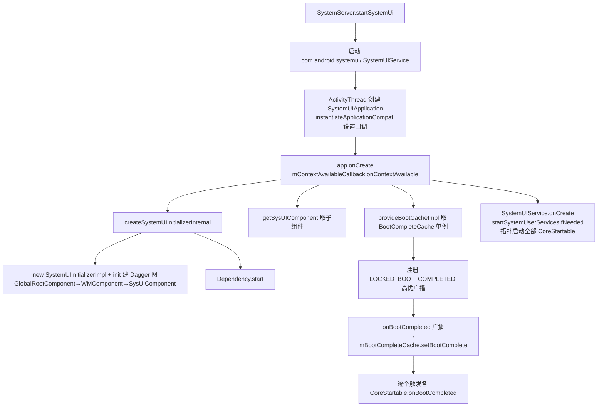

命中了 `SystemUIAppComponentFactoryBase.kt` 与 `SystemUIApplication.java`,我读取这些核心文件。
核心链路已定位,继续读取 `SysUIComponent`、`BootCompleteCacheImpl`、`SystemUIInitializer` 及工厂实现。
主链路源码已全部拿到。再快速确认 `BootCompleteCache` 的消费方与 `startSystemUserServicesIfNeeded` 的调用点,以便讲清作用。
补充确认 Manifest 中工厂声明。
# SystemUI 启动三行代码全链路详解

你贴的这三行代码位于 **`SystemUIApplication.onCreate()`**（Android 15, `frameworks_base_15`）,是 SystemUI 进程启动的核心——**在 Application 层手工完成整套 Dagger 依赖图搭建 + 拉取首个关键单例**。先给总览图,再逐行拆解。



## 0. 这三行所处的上下文

```110:113:packages/SystemUI/src/com/android/systemui/SystemUIApplication.java
mInitializer = mContextAvailableCallback.onContextAvailable(this);
mSysUIComponent = mInitializer.getSysUIComponent();
mBootCompleteCache = mSysUIComponent.provideBootCacheImpl();
```
 
 
它被 `TimingsTraceLog("SystemUIBootTiming")` 的 `traceBegin("DependencyInjection")` / `traceEnd()` 包住,是整个 SystemUI 启动时序里第一个可观测阶段。要理解它,必须先搞清楚 **`mContextAvailableCallback` 是谁、何时、怎样被赋值的**。

## 1. 前置:回调在 Application 实例化阶段就被注入

SystemUI 的 Manifest 同时声明了 Application 与工厂:

```386:400:packages/SystemUI/AndroidManifest.xml
android:name=".SystemUIApplication"
...
android:appComponentFactory=".PhoneSystemUIAppComponentFactory">
```

`ActivityThread.handleBindApplication()` 用清单里的 `appComponentFactory` 通过 `Instrumentation.newApplication()` 创建 Application 时,会走到 **`PhoneSystemUIAppComponentFactory.instantiateApplicationCompat()`**(它继承自 `SystemUIAppComponentFactoryBase`)。关键就在基类这里:

```81:92:packages/SystemUI/src/com/android/systemui/SystemUIAppComponentFactoryBase.kt
override fun instantiateApplicationCompat(cl: ClassLoader, className: String): Application {
    val app = super.instantiateApplicationCompat(cl, className)
    if (app !is ContextInitializer) {
        throw RuntimeException("App must implement ContextInitializer")
    } else {
        app.setContextAvailableCallback { context ->
            createSystemUIInitializerInternal(context)
        }
    }
    return app
}
```

也就是说:框架先裸构造出 `SystemUIApplication`,再调用 `setContextAvailableCallback(...)` 把 **一个 lambda** 塞进 `mContextAvailableCallback` 字段。SystemUI 之所以这么绕,是因为 **Application 实例由系统框架创建、不经过 Dagger**,而 DI 图需要 Application Context 才能 build,于是把"建图"延迟到 `onCreate()` 里、以回调形式注入。这个"裸构造对象 + 回调注入"的设计(`ContextInitializer` / `ContextAvailableCallback` 这一对接口)同时服务于 `Application` 和 `ContentProvider`(`KeyguardSliceProvider`、`PeopleProvider` 等),因为 Provider 的成员注入时机更晚。

`setContextAvailableCallback` 的实现就是简单的字段保存:

```467:471:packages/SystemUI/src/com/android/systemui/SystemUIApplication.java
public void setContextAvailableCallback(
        @NonNull SystemUIAppComponentFactoryBase.ContextAvailableCallback callback) {
    mContextAvailableCallback = callback;
}
```

## 2. 第一行:`mInitializer = mContextAvailableCallback.onContextAvailable(this);`

`onContextAvailable(this)` 回调实际执行的是刚才那个 lambda → `createSystemUIInitializerInternal(context)`:

```62:79:packages/SystemUI/src/com/android/systemui/SystemUIAppComponentFactoryBase.kt
private fun createSystemUIInitializerInternal(context: Context): SystemUIInitializer {
    return systemUIInitializer ?: run {
        val initializer = createSystemUIInitializer(context.applicationContext)
        try {
            initializer.init(false)
        } ...
        initializer.sysUIComponent.inject(
            this@SystemUIAppComponentFactoryBase
        )
        systemUIInitializer = initializer
        return initializer
    }
}
```

注意这里的机制,值得逐条读:

- **首次调用才会真正建图**(静态 `systemUIInitializer` 判空 + `?:` 懒加载)。Application、`KeyguardSliceProvider` 等可能各自触发回调,但全局**只有一份**初始化器(静态字段还规避了 http://b/141008541 的时序 bug)。
- `createSystemUIInitializer(context)` 是抽象方法,AOSP 手机实现返回 `SystemUIInitializerImpl`,它只做一件事——返回 `DaggerReferenceGlobalRootComponent.builder()`(Dagger 注解处理器生成的组件代码):
  ```26:30:packages/SystemUI/src/com/android/systemui/SystemUIInitializerImpl.kt
  class SystemUIInitializerImpl(context: Context) : SystemUIInitializer(context) {
      override fun getGlobalRootComponentBuilder(): GlobalRootComponent.Builder {
          return DaggerReferenceGlobalRootComponent.builder()
      }
  }
  ```
- 紧接着 **`initializer.init(false)` 是真正的重头戏**,它完成三层 Dagger 图的级联构建:

```73:132:packages/SystemUI/src/com/android/systemui/SystemUIInitializer.java
public void init(boolean fromTest) throws ExecutionException, InterruptedException {
    mRootComponent = getGlobalRootComponentBuilder()
            .context(mContext)
            .instrumentationTest(fromTest)
            .build();
    ...
    setupWmComponent(mContext);
    SysUIComponent.Builder builder = mRootComponent.getSysUIComponent();
    if (initializeComponents) {
        builder = prepareSysUIComponentBuilder(builder, mWMComponent)
                .setShell(mWMComponent.getShell())
                .setPip(mWMComponent.getPip())
                .setSplitScreen(mWMComponent.getSplitScreen())
                .setOneHanded(mWMComponent.getOneHanded())
                .setBubbles(mWMComponent.getBubbles())
                ...
                .setDesktopMode(mWMComponent.getDesktopMode());
        mWMComponent.init();
    } ...
    mSysUIComponent = builder.build();
    Dependency dependency = mSysUIComponent.createDependency();
    dependency.start();
}
```

层级是 `GlobalRootComponent`(进程级,提供 `Context`/`MainLooper`/`ProcessWrapper` 等)→ `WMComponent`(承接 `com.android.wm.shell` 的 Shell/Pip/SplitScreen/Bubbles 等 12 个 WMShell 部件,把它们的实例 **`@BindsInstance` 绑进 SysUI**)→ `SysUIComponent`(@SysUISingleton 子组件,装载 `SystemUIModule`、`SystemUICoreStartableModule`、`ReferenceSystemUIModule` 等 8 个模块)。图上还有 `DumpManager`、`InitController`、全部 `CoreStartable` 的 Provider Map 等。最后 `Dependency.start()` 保证这个兼容层老入口最先就绪。

`init()` 返回后,回调里还会执行 `initializer.sysUIComponent.inject(this@Factory)`——给工厂本身做成员注入(`ContextComponentHelper`,用于后续用 Dagger 解析 Activity/Service/Receiver)。

**所以第一行的返回值 `SystemUIInitializer` 本质是一个"持有已建好 Dagger 图的句柄"**,`onContextAvailable(this)` 的执行代价就是整个 SystemUI 依赖图的构建。

## 3. 第二行:`mSysUIComponent = mInitializer.getSysUIComponent();`

纯粹是取字段:

```173:175:packages/SystemUI/src/com/android/systemui/SystemUIInitializer.java
public SysUIComponent getSysUIComponent() {
    return mSysUIComponent;
}
```

拿到刚 build 好的那个 **`@SysUISingleton` 作用域的子系统组件**。SysUI 里所有核心单例对象都从它派生,后面 `startSystemUserServicesIfNeeded()` 里的 `getStartables()`、`getStartableDependencies()`、`createDumpManager()`、`getInitController()` 全是这个组件的方法。SystemUIApplication 之后依赖的都是**同一个**组件实例。

## 4. 第三行:`mBootCompleteCache = mSysUIComponent.provideBootCacheImpl();`

### 4.1 这是 SysUIComponent 上的一个作用域化 provision 方法

```120:124:packages/SystemUI/src/com/android/systemui/dagger/SysUIComponent.java
/**
 * Provides a BootCompleteCache.
 */
@SysUISingleton
BootCompleteCacheImpl provideBootCacheImpl();
```

Dagger 语义:`@SysUISingleton` 保证返回值在 **SysUIComponent 生命周期内只创建一次**(Dagger 生成的 `DaggerReferenceSysUIComponent` 内部持有一个缓存的 `BootCompleteCacheImpl` 字段,方法只是把这个字段交出去)。实现类 `BootCompleteCacheImpl` 用 `@Inject` 构造,因此无需任何 module 手动绑定:

```34:49:packages/SystemUI/src/com/android/systemui/BootCompleteCacheImpl.kt
@SysUISingleton
class BootCompleteCacheImpl @Inject constructor(dumpManager: DumpManager) :
        BootCompleteCache, Dumpable {
    ...
    @GuardedBy("listeners")
    private val listeners = mutableListOf<WeakReference<BootCompleteCache.BootCompleteListener>>()
    private val bootComplete = AtomicBoolean(false)
```

它在构造时向 `DumpManager` 注册了 `dumpsys` 入口(`dump` 输出 boot 状态与未清空的 listener 列表),内部状态是两个关键结构:**`AtomicBoolean bootComplete`** 做线程安全的完成标记 + **`WeakReference` 监听器列表**防止泄漏。对外接口:

- `isBootComplete()`:查当前是否已达 `PHASE_BOOT_COMPLETED`;
- `setBootComplete()`:用 `compareAndSet(false, true)` 置位,**只在首次翻转时**遍历通知所有存活 listener 并清空列表(幂等);
- `addListener()`:注册监听,若已 boot complete 则**立即返回 true**(调用方据此直接执行就绪逻辑,不再等待回调);
- `removeListener()`:注销。

### 4.2 SystemUIApplication 为什么要亲手拿这个对象

Application 不在 Dagger 图内、无法字段注入,而它需要"外部"驱动 boot 状态翻转。紧接着的 `onCreate()` 尾部就注册了一个 **`SYSTEM_HIGH_PRIORITY` 的 `ACTION_LOCKED_BOOT_COMPLETED` 广播接收器**(SystemUI 必须抢在普通 App 之前拿到开机完成广播):

```154:169:packages/SystemUI/src/com/android/systemui/SystemUIApplication.java
registerReceiver(new BroadcastReceiver() {
    @Override
    public void onReceive(Context context, Intent intent) {
        if (mBootCompleteCache.isBootComplete()) return;
        if (DEBUG) Log.v(TAG, "BOOT_COMPLETED received");
        unregisterReceiver(this);
        mBootCompleteCache.setBootComplete();
        if (mServicesStarted) {
            for (int i = 0; i < N; i++) {
                notifyBootCompleted(mServices[i]);
            }
        }
    }
}, bootCompletedFilter);
```

这是 boot 事件流的核心枢纽:AMS 在 `finishBooting()` 里发出 `LOCKED_BOOT_COMPLETED` → SystemUI 这里把标记置位 → 唤醒所有等待中的组件。因为 `@SysUISingleton` 保证 SystemUIApplication 手里这份 `mBootCompleteCache` 与注入进 `PhoneStateMonitor`、`LocationControllerImpl` 等各处的 `BootCompleteCache` **是同一个对象**,所以置位能立刻传导到所有消费方——这正是单独拉一次 provision 方法、而不是 `new` 一个的原因。

而"什么时候真正去启动所有 CoreStartable"由 `SystemUIService` 驱动:

```76:80:packages/SystemUI/src/com/android/systemui/SystemUIService.java
public void onCreate() {
    super.onCreate();
    // Start all of SystemUI
    ((SystemUIApplication) getApplication()).startSystemUserServicesIfNeeded();
```

### 4.3 `mBootCompleteCache` 在服务启动里的双保险用法

`startSystemUserServicesIfNeeded()` → `startServicesIfNeeded()` 里对 boot 完成做两件事:启动前先兜底检查系统属性 `sys.boot_completed`(处理"SystemUI 二次启动/开机早已完成"的场景),启动后逐一向每个 CoreStartable 判断是否已经 boot complete、是则立刻补发 `onBootCompleted()`:

```257:267:packages/SystemUI/src/com/android/systemui/SystemUIApplication.java
if (!mBootCompleteCache.isBootComplete()) {
    // check to see if maybe it was already completed long before we began
    // see ActivityManagerService.finishBooting()
    if ("1".equals(getRootComponent().getSystemPropertiesHelper()
            .get("sys.boot_completed"))) {
        mBootCompleteCache.setBootComplete();
        ...
```

```360:376:packages/SystemUI/src/com/android/systemui/SystemUIApplication.java
for (serviceIndex = 0; serviceIndex < mServices.length; serviceIndex++) {
    final CoreStartable service = mServices[serviceIndex];
    if (mBootCompleteCache.isBootComplete()) {
        notifyBootCompleted(service);
    }
    ...
}
mSysUIComponent.getInitController().executePostInitTasks();
```

`CoreStartable.onBootCompleted()` 的契约也正好印证这个设计(见类注释):要么开机广播来了触发,要么启动时发现 `sys.boot_completed=1` 补发,且 **一定晚于 `start()`**:

```66:72:packages/SystemUI/src/com/android/systemui/CoreStartable.java
/** Called immediately after the system broadcasts
 * {@link android.content.Intent#ACTION_LOCKED_BOOT_COMPLETED} or during SysUI startup if the
 * property {@code sys.boot_completed} is already set to 1. ...
 * {@link #onBootCompleted()} will never be called before {@link #start()}. */
default void onBootCompleted() {
```

## 5. 小结:三行代码各司其职

第一行 `onContextAvailable` = **建图**:懒执行 `SystemUIInitializerImpl.init(false)`,一次性把 `GlobalRootComponent → WMComponent → SysUIComponent` 三层 Dagger 图连同 `Dependency` 全部 build 起来,返回初始化器句柄;第二行 `getSysUIComponent` = **取组件**:拿到 `@SysUISingleton` 子组件引用,作为后续一切单例与 Startable 的入口;第三行 `provideBootCacheImpl` = **取单例**:从组件里拉出唯一的 `BootCompleteCacheImpl`,Application 自己留着它,用来在 `LOCKED_BOOT_COMPLETED` 广播到达时调用 `setBootComplete()`,从而唤醒 `PhoneStateMonitor`、`LocationControllerImpl` 等一批等待开机完成的 SysUI 组件。

踩坑点提示:SystemUIApplication 是系统框架创建的、游离于 Dagger 图之外,所以这三行手工接线是"框架对象"与"图内单例"之间唯一的桥;`provideBootCacheImpl()` 若被误改成普通 `new BootCompleteCacheImpl(...)`,广播置位将永远无法传导给注入的消费方,开机后一批组件会停在等待态——这也是把该方法定义为 `@SysUISingleton` provision、而不是简单构造器的根本原因。